# LAB2

<!-- TOC -->
## 目录

- [实验 2 布局规划](#实验-2-布局规划)
- [Task 1: Invoke ICC II and load the ORCA_TOP Block](#task-1-invoke-icc-ii-and-load-the-orca_top-block)
- [Task 2: Initial Floorplanning using the Task Assistant](#task-2-initial-floorplanning-using-the-task-assistant)
- [Task 3. Block Shaping](#task-3-block-shaping)
- [Task 4. Macro and Standard Cell Placement](#task-4-macro-and-standard-cell-placement)
- [Task 5. Place the Block Ports](#task-5-place-the-block-ports)
- [Task 6. Congestion Map](#task-6-congestion-map)
- [Task 7. Analyze Macro Placement using DFF (Data Flow Flylines)](#task-7-analyze-macro-placement-using-dff-data-flow-flylines)
- [Task 8. Register Tracing](#task-8-register-tracing)
- [Task 9. PG Prototyping](#task-9-pg-prototyping)
- [Task 10. Power Network Synthesis](#task-10-power-network-synthesis)

<!-- /TOC -->


floorplan：布局规划 \| macro：宏单元 \| voltage area (VA)：电压域PG (Power/Ground)：电源 / 地 \| congestion：拥塞 \| flyline：飞线pin：引脚 \| route：布线 \| DRC：设计规则检查

## 实验 2 布局规划

本实验旨在让你掌握 IC Compiler II 中**模块级布局规划**的基础操作。完成本实验后，你将学会：

1. 定义多边形芯片模块外形

2. 在模块内部划分电压域

3. 执行布局操作，确定宏单元摆放位置

4. 定义模块 IO 引脚位置

5. 分析布线拥塞与网表连通性

6. 执行电源网格原型布线

7. 调用脚本，完成**基于模板的电源网络综合 (PPNS）**

## Task 1: Invoke ICC II and load the ORCA_TOP Block

切换工作目录至 lab2_floorplan，并启动 IC Compiler II：Linux 终端命令：

```shell
cd lab2_floorplan
```

```tcl
icc2_shell -gui
```

点击 ICC II 窗口左下角的 ** 脚本编辑器 (Script Editor)** 标签页

3. 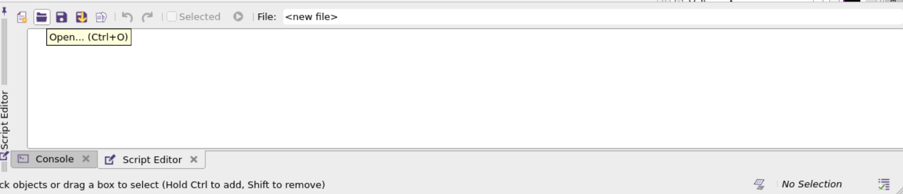

点击文件夹图标（参考上方箭头），打开 `run.tcl` 脚本文件。该文件包含本实验所有执行命令。你无需在外部编辑器复制粘贴，直接使用内置脚本编辑器：选中需要执行的命令行，点击「运行所选内容 (Run Selection)」按钮即可。实操练习：选中整行 echo "hello world"，勾选selected，点击运行按钮，在命令行（console）窗口查看输出结果。

```tcl
icc2_shell> echo "hello world"hello world
```

打开已完成网表 (Verilog)、多电压文件 (UPF)、时序约束初始化的设计模块（该模块等待布局规划）。可使用图形界面「打开已有模块」，或选中并执行以下命令：open_block `ORCA_TOP.dlib`:ORCA_TOP/floor

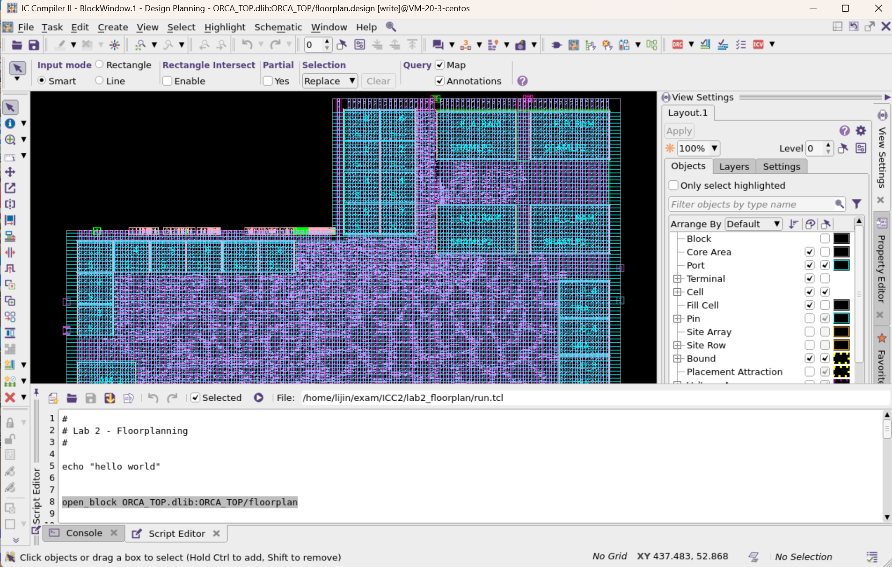

## Task 2: Initial Floorplanning using the Task Assistant

- 本环节使用**任务助手 (Task Assistant)**，后续几个任务无需执行 `run.tcl` 中的命令。在右侧面板区域（视图设置面板处）右键，选择「Tasks（任务面板）」。在任务面板顶部下拉菜单中，选择 **Design Planning（设计规划）**。补充：你也可以按快捷键 F4 调出完整任务助手，或通过菜单 Task → Task Assistant 打开；点击窗口左上角「显示任务导航树」图标，再选择 Design Planning。

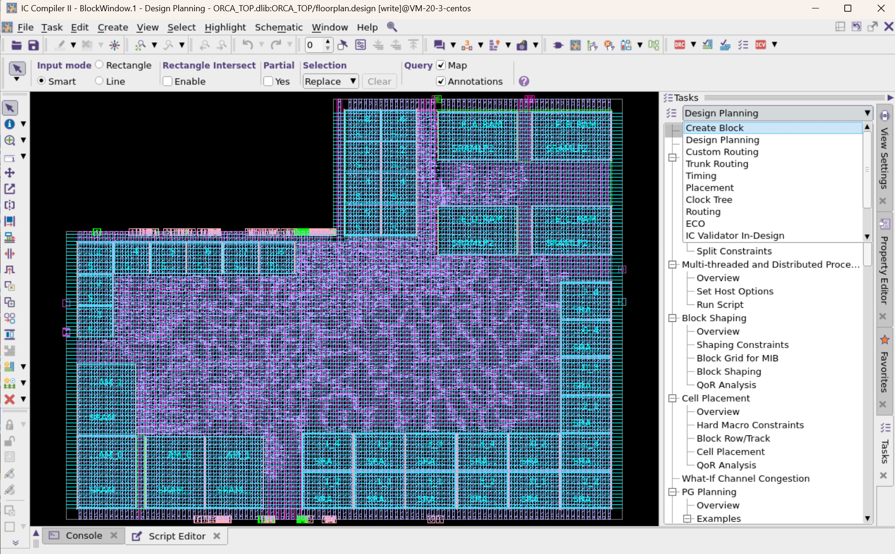

- 依次展开：Floorplan Preparation（布局准备） → Floorplan Initialization（布局初始化），弹出布局初始化窗口。

- 通过「模块外形 (Boundary Type)」和「朝向 (Orientation)」下拉框设置模块外形；点击窗口预览区下方的 Preview（预览） 校验配置。

- 确认尺寸控制模式（side size control）为 **Ratio（比例模式）**。

- 填写四边尺寸数值：要求边 c 的长度为 a/b/d 的一半（a/b/d 长度相等）。

- 预览布局，确认无误后，设置**芯片内核 (Core) 与芯片边界 (Die) 的统一间距为 20**。

- 点击 Apply（应用） 生成初始布局。

注：内核形状 = L 型，朝向 = W；四边参数：a=2、b=2、c=1、d=2。

你最后看到的界面大概是这样

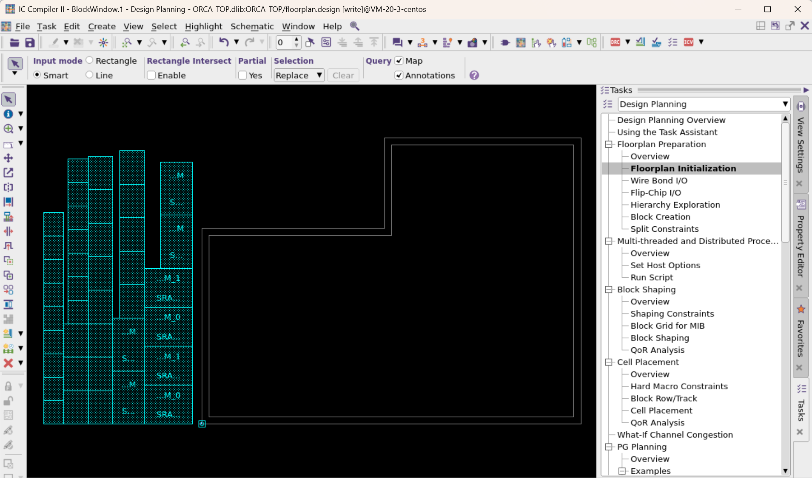

## Task 3. Block Shaping

在任务面板中选择 Block Shaping（模块整形）→ Block Shaping，该功能用于**自动划分电压域**。

切换到整形选项（shaping option）右侧的 Shape Blocks（模块整形） 标签页，点击 Apply。

等待片刻，操作完成，将布局视图切换到前台。

打开右侧 **视图设置 (View Settings) → Objects（对象）** 面板，勾选 Voltage Area（电压域） 使其可见；展开电压域选项，同时开启 Guardband（保护带） 显示。

视图中将出现两个电压域：右上角为 PD_RISC_CORE，其余区域为默认电压域 DEFAULT_VA。

10. 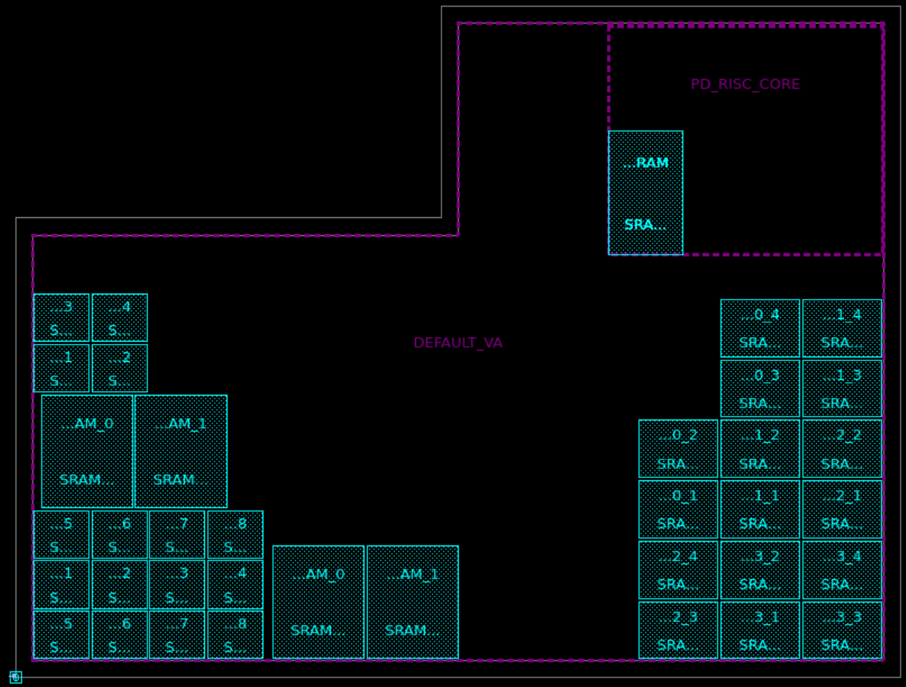

你会看到：默认电压域内的宏单元已完成初步摆放；而 PD_RISC_CORE 电压域内的 4 个宏单元相互重叠，这属于正常现象。当前仅完成顶层宏单元摆放，非默认电压域内的宏单元将在 Task4 中完成布局。

**术语注解**：Guardband（保护带）：电压域边界的禁止摆放区域，防止不同电压模块相互干扰。

## Task 4. Macro and Standard Cell Placement

- 在任务面板中选择 Cell Placement（单元布局）→ Cell Placement。补充：Cell Placement → Hard Macro Constraints（宏单元约束） 可设置宏单元禁布区，本实验为简化流程暂不使用。

- 在布局窗口中，勾选 **Use floorplanning placement（布局规划模式）**。

- 点击 Apply 执行布局。

- 开启引脚（pin）显示，在图形界面中查看宏单元布局效果。工具会自动在宏单元之间生成**布线通道**，并在狭窄通道内添加**软布局阻塞块（soft placement blockages）**，以此降低拥塞、提升可布线性。宏单元边缘的引脚数量越多，对应的布线通道宽度越大。

- 同时工具会自动翻转宏单元，让引脚密集的一侧相对摆放，以此缩小宏单元之间的通道总面积。

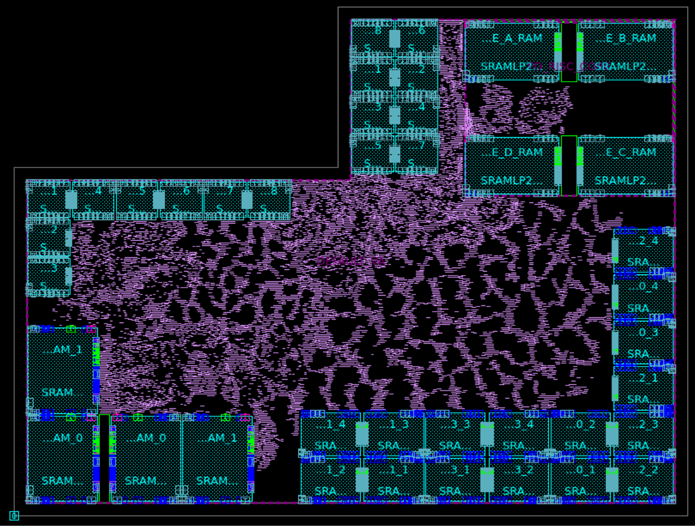

## Task 5. Place the Block Ports

```tcl
1. 你也可以使用任务助手摆放引脚,本环节直接在 run.tcl 中选中并执行以下命令:
```

```tcl
set_block_pin_constraints -self -allowed_layers {M3 M4 M5 M6}
```

place_pins `-self`

查看布局：模块所有端口（物理引脚的逻辑形态）均已摆放完成。

放大单个端口，验证引脚仅布放在 M3~M6 金属层。补充：若需要选中物理引脚，请在视图设置中开启 Terminal（物理端口） 的可选中属性。

```tcl
查找所有时钟类(clk)端口 / 物理引脚并放大查看,可参考 run.tcl 中的提示。
```

```tcl
6. change_selection \[get_ports *clk\]
```

7. \# Press ctrl-t or use the following Tcl command:

```tcl
8. gui_zoom -window \[gui_get_current_window -view\] -selection
```

执行 `run.tcl` 中创建**引脚引导区 (Pin Guide)** 的命令：该功能用于约束所有时钟引脚摆放在指定区域。随后在 View Settings → Objects 面板中，开启 Guide → Pin Guide 显示；放大高亮区域即可查看引脚引导区。

将所有时钟端口的宽度设置为 0.1、长度设置为 0.4，重新执行引脚摆放。最终效果：所有时钟引脚都被限制在引脚引导区内，且尺寸已按要求修改。这是引脚约束的典型案例，你可查阅命令手册了解更多引脚配置方式。

Task5相关代码注释

\# 1. 全局引脚布线层约束 set_block_pin_constraints `-self -allowed_layers` {M3 M4 M5 M6} \# 2. 执行全局引脚摆放 place_pins `-self` \# 3. 选中所有时钟引脚 change_selection \[get_ports *clk\] \# 4. 视图缩放到时钟引脚 gui_zoom `-window` \[gui_get_current_window `-view`\] `-selection` \# 5. 创建时钟引脚专属引导区（Pin Guide） create_pin_guide `-exclusive -boundary` {{483 538}} \[get_ports *clk\] `-name clk_ports` `-pin_spacing 5` \# 6. 开启引脚引导区显示 gui_set_setting `-window` \[gui_get_current_window `-types Layout` `-mru`\] `-setting showPinGuide` `-value true` \# 7. 单独设置时钟引脚尺寸（宽0.1 / 长0.4） set_individual_pin_constraints `-ports` \[get_ports *clk\] `-width 0.1` `-length 0.4` \# 8. 重新摆放引脚，让时钟引脚约束生效 place_pins `-self` \# 9. 再次选中时钟引脚并缩放查看结果 change_selection \[get_ports *clk\] gui_zoom `-window` \[gui_get_current_window `-view`\] `-selection`

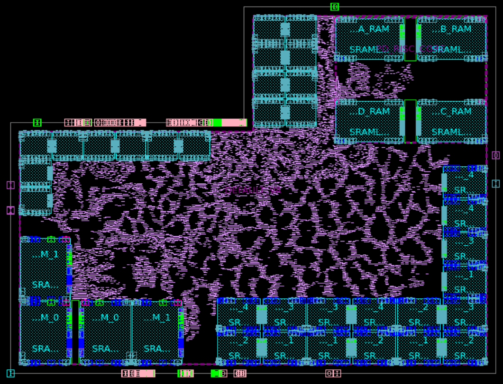

## Task 6. Congestion Map

点击顶部 Maps（视图） 下拉菜单，注意是map上方工具栏的按键，选择 **Global Route Congestion（全局布线拥塞图）**。

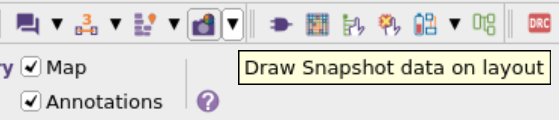

点击 Reload（重新加载），在弹窗中点击 OK。

工具完成全局布线后，布局会更新为**拥塞热力图**。本设计无严重拥塞：从柱状图可见，绝大多数布线溢出值为 1，极少区域溢出值大于 2。

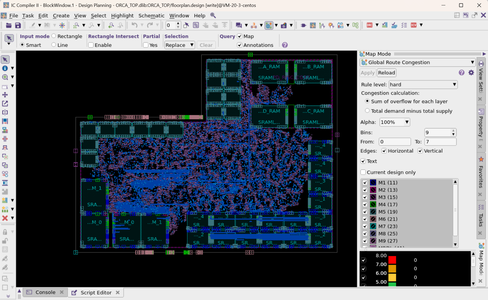

调整分区参数（参考截图）：分区范围：From=-2、To=2，同时勾选水平 / 垂直走线；原分区数量为 9，修改后将溢出值 -2 ~ 2 单独分区，大于 2、小于 - 2 的溢出值分别合并。修改后低溢出区域会显示得更明显，你会看到大量区域溢出值为 0。注：仅修改显示样式，**不会改变真实拥塞结果**，本设计不存在严重布线问题。将鼠标悬停在布线上，可弹出溢出详情。

点击全局拥塞图图标或关闭面板，退出拥塞视图。

**术语注解**：Overflow（溢出）= 布线资源缺口，数值越大代表拥塞越严重。

## Task 7. Analyze Macro Placement using DFF (Data Flow Flylines)

- **数据流飞线 (DFF)** 功能不仅可以查看引脚直连关系，还能分析经过组合逻辑、寄存器的互联关系。借助该功能可整体评估设计，辅助优化宏单元布局（宏布局对标准单元摆放影响极大）。

- 点击 Maps 左侧的 Connectivity（连通性） 下拉菜单，选择 **Data Flow Flylines（数据流飞线）**。

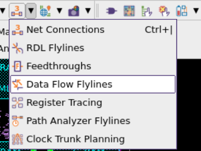

- 点击 Reload。弹窗中可配置飞线追踪层级（可设置需要遍历的寄存器级数），追踪级数越高，计算耗时越长。本实验使用默认配置，点击 OK。

- 加载完成后，在分析对象中勾选 **Macros和Ports（宏单元与端口）**，点击 Apply 启用飞线分析；也可开启「自动应用 (Auto apply)」，修改配置后即时生效。

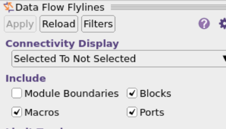

- 单击任意宏单元，查看其与其他宏、端口的互联飞线。可勾选「寄存器数量 / 门电路数量」并设置最大 / 最小值，限制追踪层级，快速判断互联是直连、还是经过多级门电路 / 寄存器。

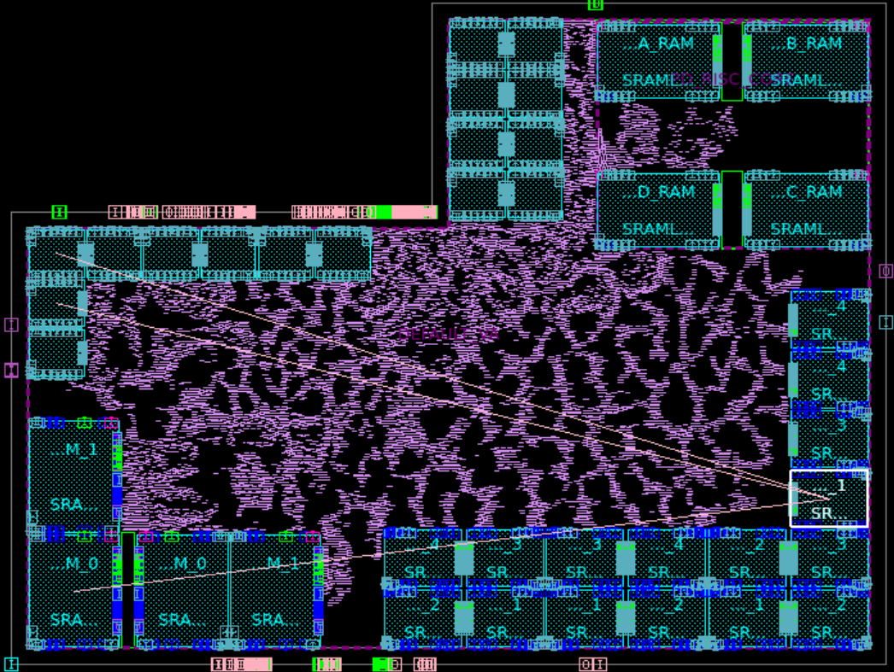

- 点击任意飞线，可查看该互联的详细信息。

- 补充说明：若连线终点为寄存器，DFF 不会显示飞线；仅会根据你的配置，展示**宏与宏、宏与端口**之间的连线。

- 关闭数据流飞线面板。

## Task 8. Register Tracing

在连通性下拉菜单中，选择 **Register Tracing（寄存器追踪）**（位于数据流飞线下方）。

选中任意宏单元，工具会直接高亮与之相连的寄存器（跳过中间逻辑）；勾选「Show flylines（显示飞线）」，可查看宏与寄存器之间的连线。

```tcl
在「追踪限制」中将 Max levels(最大层级) 设置为 2,并勾选「Level 2」,可查看下一级寄存器;二级寄存器会使用不同颜色高亮。
```

在高亮选项中，可选择显示 **End points（末端节点，最后一级寄存器）**以及**Direct end points（直连节点，与宏直接相连的端点）**。

6. 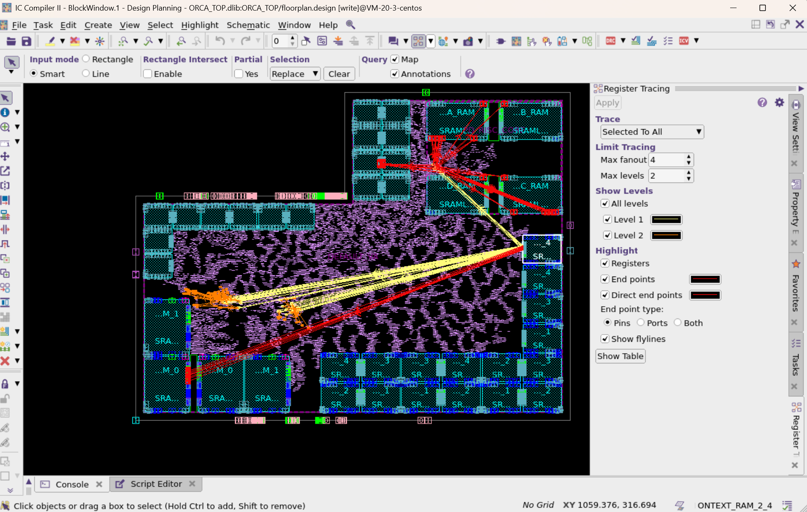

关闭寄存器追踪面板。

本实验中宏单元布局已达标，接下来**锁定宏单元位置**。操作：选中所有宏单元点击锁定图标，或执行以下命令：

set_fixed_objects \[get_flat_cells `-filter` "is_hard_macro"\]**\##把所有硬宏单元（Hard Macro，如 RAM/ROM/IP）设为固定状态，防止后续布局、布线、优化步骤移动它们**。

**术语注解**：fixed objects 固定对象，锁定后后续布局 / 布线不会移动宏单元。

## Task 9. PG Prototyping

- 在任务面板中选择 PG Planning（电源规划）→ PG Prototyping（电源原型布线）。

- 点击窗口中 Default（默认） 查看原始配置：工艺文件默认使用 MRDL、M9 分别作为垂直、电源金属层。

- 修改配置：**垂直电源层改为 M8，水平电源层改为 M7**。

- 点击 Apply，数秒后生成基础电源网格，电源线不会穿越宏单元。

- 可修改金属层、布线占比参数，测试不同电源网格配置；修改前请先移除原有电源线。

- 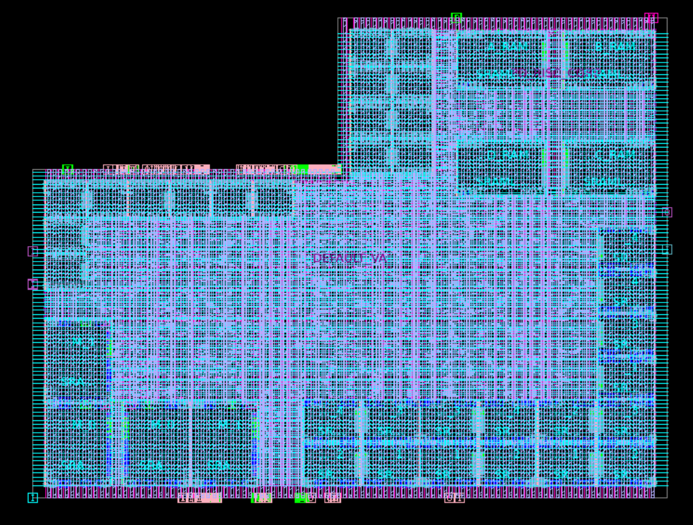

## Task 10. Power Network Synthesis

查看电源网络综合脚本 `scripts/pns.tcl`（可使用内置脚本编辑器打开）。脚本逻辑：先删除已有电源网格，再通过 create_pg\_*\_pattern 创建电源模板、set_pg_strategy 配置电源策略，最后执行 compile_pg 编译生成完整电源网络。

调用执行脚本：

```tcl
source scripts/pns.tcl
```

脚本执行完成后，在布局视图中查看整体电源网格、宏单元电源连接、标准单元电源轨。补充：本实验电源网格存在少量瑕疵，流片级设计中需要进一步优化。

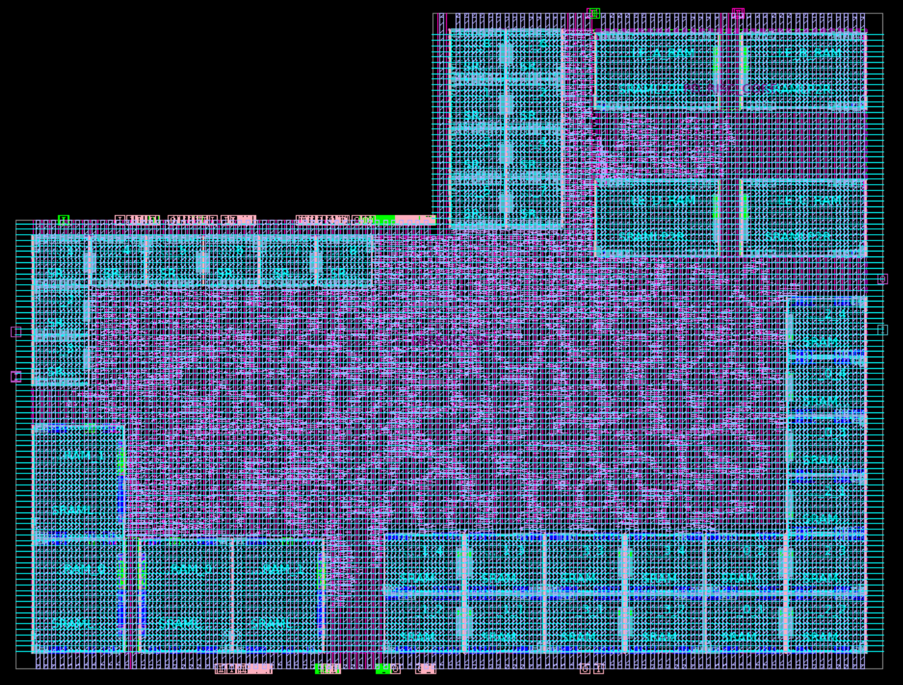

保存设计并退出 ICC II：

```tcl
save_lib
exit
```
