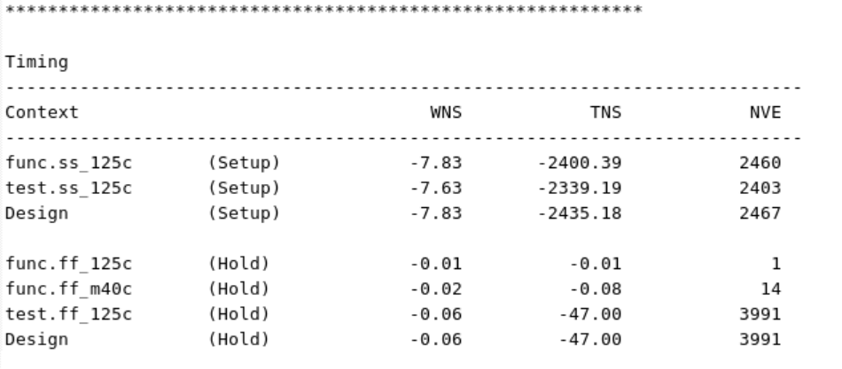

# LAB3

<!-- TOC -->
## 目录

- [实验 3 布局与优化](#实验-3-布局与优化)
    - [统一专业术语](#统一专业术语)
- [任务 1：启动 ICC II 并加载 ORCA_TOP 设计模块](#任务-1启动-icc-ii-并加载-orca_top-设计模块)
- [任务 2 执行布局与优化](#任务-2-执行布局与优化)
    - [模块 1：布局前检查（Pre-placement Checks）](#模块-1布局前检查pre-placement-checks)
    - [模块 2：布局前基础配置（Pre-placement Settings）](#模块-2布局前基础配置pre-placement-settings)
    - [模块 3：漏功耗 + 动态功耗优化配置](#模块-3漏功耗-动态功耗优化配置)
    - [模块 4：层优化 & 布线驱动寄生提取（RDE）](#模块-4层优化-布线驱动寄生提取rde)
    - [模块 5：集成时钟门控（ICG）优化](#模块-5集成时钟门控icg优化)
    - [模块 6：布局执行与结果分析](#模块-6布局执行与结果分析)
- [参考答案（Answers / Solutions）](#五-参考答案answers-solutions)
- [实操复现补充提示](#六-实操复现补充提示)

<!-- /TOC -->


## 实验 3 布局与优化

#### 统一专业术语

placement 布局 \| optimization 优化 \| pre-check 前置检查timing 时序 \| congestion 拥塞 \| violation 违例MCMM 多角多模式 \| Vt 阈值电压 \| RDE 路由驱动提取ICG 时钟门控 \| slack 时序裕量 \| fanout 扇出

本实验带你掌握 IC Compiler II 的布局与优化操作。完成本实验后，你将掌握以下技能：

1. 执行布局前置检查

2. 运行布局优化命令 place_opt

3. 分析布局结果（时序、拥塞、设计质量）

4. 使用设计浏览器分析各类违例问题

## 任务 1：启动 ICC II 并加载 ORCA_TOP 设计模块

- 切换至本实验工作目录，以图形界面模式启动 ICC II，并加载设计：

- shell

- \# Linux终端执行

```shell
UNIX% cd lab3_place
```

```shell
UNIX% icc2_shell -gui -f load.tcl
```

- 该脚本会将已完成前期准备的模块 ORCA_TOP/init_design 复制为 ORCA_TOP/place_opt，并自动打开该模块。

- 生成**结果质量（QoR）汇总报告**，查看初始状态：

- tcl

```tcl
- report_qor -summary
```

- 执行后可观察到：此时设计尚未执行布局与优化，**最大负时序裕量（WNS）、总负时序裕量（TNS）数值均偏大**。

- 

## 任务 2 执行布局与优化

```tcl
请逐行运行 run.tcl 中的命令,下文按功能模块拆分解读,并附带思考题。
```

#### 模块 1：布局前检查（Pre-placement Checks）

正式布局前，需排查会导致 place_opt 运行异常的问题，结合脚本命令完成以下思考题：

> 问题 1：设计中是否还存在未处理的理想网络（ideal nets）？问题 2：当前模块设置的最大布线层是哪一层？补充说明：本设计基于 SCANDEF 定义了扫描链（扫描测试电路）。问题 3：该设计包含多少条扫描链？高扇出网络会严重影响布局与时序，ICC II 中使用 report_net_fanout 分析扇出，结合脚本回答：问题 4：扇出数大于 60 的**非时钟类**高扇出网络一共有多少条？

#### 模块 2：布局前基础配置（Pre-placement Settings）

对于 12nm 及以下先进工艺，需使用 set_technology 命令配置 ICC II，该命令会批量修改工具配置项以适配对应工艺。若要在布局优化过程中插入**钳位单元（tie cells）**，需保证库中的钳位单元未被添加 dont_touch（禁止修改）属性，同时将其纳入优化单元范围。

> 问题 5：使用哪条命令 / 配置项可将单元加入优化范围？

#### 模块 3：漏功耗 + 动态功耗优化配置

默认情况下，place_opt 不会开启漏功耗、动态功耗优化；若需功耗优化，必须手动开启，并保证至少有一个工作场景（scenario）启用对应功耗分析。**工具配置项**：opt.power.mode（功耗优化模式）

#### 模块 4：层优化 & 布线驱动寄生提取（RDE）

**层优化（Layer Optimization）**工具会识别长走线、时序关键网络，并将其优先分配至高层金属走线（电阻更低）。place_opt 中定义的最大 / 最小布线层约束，会同步延续到布线后优化阶段。**工具配置项**：place_opt.flow.optimize_layers

**布线驱动寄生提取（RDE, Route Driven Extraction）**先对初步布局的设计执行全局布线，生成 RDE 寄生参数表；后续所有虚拟寄生参数提取、布局优化、时钟树综合（CTS）都会复用该数据表，**大幅提升布局前后的时序相关性**。16nm 及以下工艺默认开启 RDE（auto），也可手动强制开启。**工具配置项**：opt.common.enable_rde

#### 模块 5：集成时钟门控（ICG）优化

仅当设计存在**集成时钟门控（ICG）建立时间违规**时，才需要开启 ICG 优化；本设计无此类问题，为控制运行时长，建议关闭该优化。**工具配置项**：place_opt.flow.optimize_icgs

#### 模块 6：布局执行与结果分析

确保扫描链在 place_opt 阶段被同步优化，确认可测试性（DFT）相关配置：

### 问题 6：用于扫描链优化的工具配置项是什么？其默认值是什么？

**高级合法化工具（Advanced legalizer）**12nm 及以下工艺推荐开启高级合法化工具；本实验基于 32nm 工艺，你也可手动开启测试效果：

set place.legalize.enable_advanced_legalizer true

执行布局优化可选择分步执行各阶段，或单条命令执行完整 place_opt 全流程（完整流程运行约 10 分钟）。

布局完成后检查两项核心问题：

11. 1.  布线拥塞：本设计无严重拥塞问题；在 ** 视图设置（View Settings）** 中开启「单元禁止摆放边距（Cell Keepout Margin）」可见：RAM 宏单元之间的通道已被屏蔽，这是拥塞表现良好、运行效率高、时序达标重要原因。

2. 时序：开启高级合法化工具后，设计时序基本可满足要求。

### 五、 参考答案（Answers / Solutions）

#### 问题 1

**问题**：设计中是否还存在未处理的理想网络？**解答**：执行 report_ideal_network 报告后可见：**所有工作场景下均无残留理想网络**。若存在理想网络，需使用 remove_ideal_net 命令清除。

#### 问题 2

**问题**：当前模块设置的最大布线层是哪一层？**解答**：执行 report_ignored_layers 命令查询结果：当前设计**最大信号布线层为 M8**。补充说明：本工艺库共 9 层金属，但设计限制信号布线仅使用 M1~M8；M7、M8 同时用于电源地（PG）网格布线，M9 在本设计中不使用。

#### 问题 3

**问题**：该设计包含多少条扫描链？**解答**：设计一共包含 **8 条扫描链**。可通过 report_design `-summary` 报告末尾、或专用命令 get_scan_chain_count 查看数量。

#### 问题 4

**问题**：扇出数大于 60 的非时钟类高扇出网络一共有多少条？**解答**：

1. 全局统计：扇出数 ≥60 的网络总计 10 条；

2. 剔除时钟类网络（网络名含 clk、驱动引脚含 CLK）后：**扇出数大于 60 的非时钟高扇出网络共 2 条**。脚本中使用过滤参数 `-filter net_type`==signal 可精准筛选信号类网络。

#### 问题 5

**问题**：使用哪条命令 / 配置项可将单元加入优化范围？**解答**：

```tcl
set_lib_cell_purpose -include optimization
```

#### 问题 6

**问题**：用于扫描链优化的工具配置项是什么？其默认值是什么？**解答**：配置项名称：opt.dft.optimize_scan_chain默认值：true（默认开启扫描链优化）

### 六、 实操复现补充提示

1. **命令执行规范**ICC II 脚本编辑器操作：选中单行 / 多行命令 → 点击「Run Selection」执行，**严禁全选一次性运行**，每执行一条观察终端日志与 GUI 视图变化。

2. **日志查看**重点关注报错（Error）、告警（Warning）：布局前若出现库关联、层约束、扫描链报错，需先修复再继续。

3. **视图辅助**

1. 查看单元禁止摆放边距：View Settings → Objects → 勾选 Cell Keepout Margin；

2. 查看布线拥塞：可复用实验 2 的拥塞图功能，验证布局后拥塞状态。

4. **耗时说明**place_opt 全流程运行约 10 分钟，执行期间请勿操作工具，等待命令执行完成后再生成报告。

