# ICC II 使用手册

> icc2 lab0

## 任务概览

- Task1：启动 ICC II 并加载示例设计
- Task2：布局视图缩放、平移、导航
- Task3：控制图层、设计对象的显示 / 选中权限
- Task4：设计对象选中、悬停、属性查询
- Task5：视图层级（View Level）控制（查看宏内部）
- Task6：GUI 面板拆分、拖拽、布局重组
- Task7：时序分析窗口基础使用
- Task8：最近操作菜单 & 收藏夹
- Task9：工具帮助体系（命令搜索、help/man 手册） 最后正常退出 ICC II。
## Task 1：启动 ICC II + 加载设计（基础启动）

### 操作步骤

#### 步骤 1：登录 Linux 环境

#### 步骤 2：进入实验目录，启动 ICC II Shell

在 Linux 终端依次执行以下命令：

```tcl
# 进入Lab0专属工作目录
cd lab0_gui
# 启动ICC II 命令行终端
icc2_shell
```

**执行成功标志：**终端提示符变为 icc2_shell>，代表进入 ICC II 交互命令行。

```tcl
icc2_shell> 
icc2_shell> ICC II
```

#### 步骤 3：查看日志文件（理解 ICC II 日志机制）

执行命令：

```tcl
icc2_shell> ls
```

服务器下正常输出为

```tcl
icc2_shell> ls
. icc2_output.txt
.. icc2_shell.cmd.4549.2026-06-08_13-30
.synopsys_icc2.setup icc2_shell.log.4549.2026-06-08_13-30
ORCA_TOP.dlib
icc2_shell>
```

你会看到目录下生成三类文件：

```tcl
icc2_shell.cmd.*：命令日志，记录从启动开始所有执行的命令（含工具初始化命令）；
icc2_shell.log.*：运行日志，记录命令 + 命令输出结果；
icc2_output.txt：全量输出日志。
```

#### 步骤 4：**启动 ICC II 图形界面（GUI）

```tcl
icc2_shell> start_gui
```

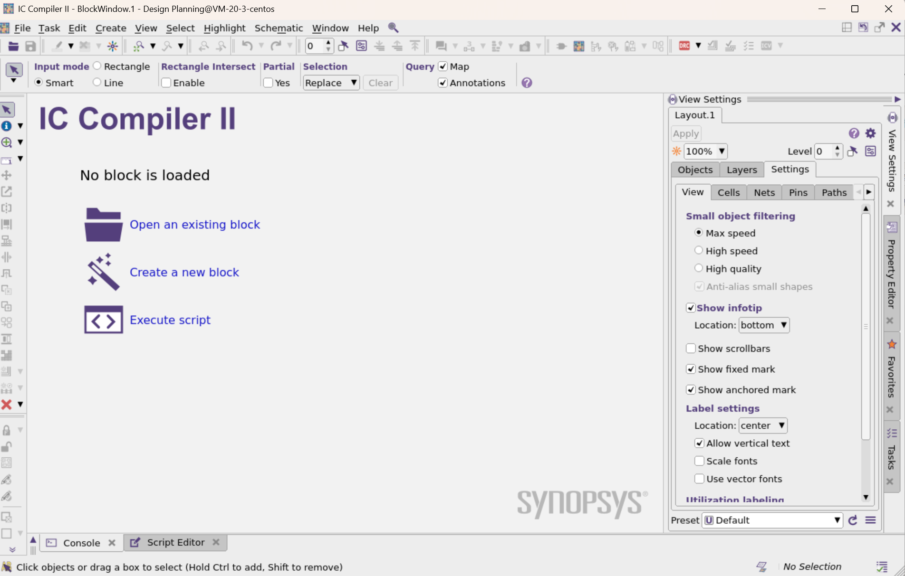

也可以在终端输入icc2_shell -gui

即可打开图形化界面

#### 步骤 5：打开已有设计模块

在 GUI 顶部工具栏，点击 「Open an existing block」图标（打开模块按钮）；

在弹出窗口右上角，点击黄色文件夹图标，选择设计库：ORCA_TOP.dlib；

库加载后，在列表中选中 ORCA_TOP/placed，点击 OK；

将 GUI 窗口最大化：布局视图会自动适配窗口大小。

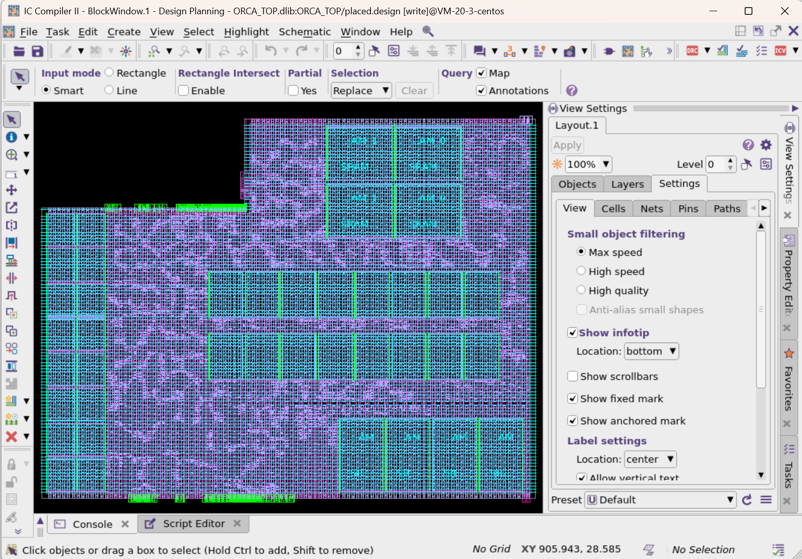

当前加载的是已完成宏摆放、电源网格、标准单元布局的 ORCA 设计。你能直观看到：

大型 Hard Macro（宏单元）：预定义位置摆放；

PG Mesh（电源网格）：横竖交错的 VDD/VSS 电源走线；

标准单元：已完成布局。

## Task 2：布局视图导航（缩放、平移、快捷键）

本任务掌握视图浏览，是后端工程师最常用的基础操作。

### 1. 工具栏按钮操作

GUI 顶部有 Zoom（缩放）、Pan（平移） 按钮：

鼠标悬停在按钮上，会弹出Tooltip 提示（功能说明）；

点击 Zoom：进入缩放模式；点击 Pan：进入平移模式；

退出缩放 / 平移：按键盘 Esc 键，或点击左上角白色箭头（选择工具）。

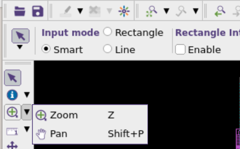

快捷键

| 快捷键 | 功能 |
| --- | --- |
| F / Ctrl+F | 视图全屏适配（缩放到显示整个设计，最常用） |
| + / = | 放大 2 倍 |
| - | 缩小 2 倍 |

### 3. 鼠标手势操作

先按键盘 Z 键，激活手势模式；

鼠标中键（滚轮） 配合拖动：

按住中键垂直向上 / 向下：整体缩放；

中键45° 斜向拖动：框选区域局部放大 / 缩小；

中键水平左右拖动：平移视图（选中区域居中）；

操作完成按 Esc 退出手势模式。

### 4. 其他导航方式

键盘方向键：↑↓←→ 上下左右平移视图；

鼠标滚轮：直接滚动，以鼠标指针为中心放大 / 缩小。

### 5. 查看全部热键

顶部菜单：Help → Report Hotkey Bindings，会弹出热键清单窗口，查看完毕关闭窗口即可。

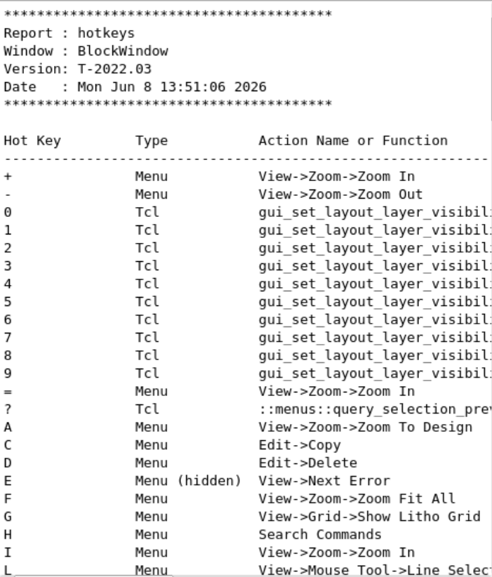

注：一般用键盘方向键和鼠标滚轮即可，个人感觉手势模式不太好用

## Task 3：对象 & 图层 显隐 / 选中控制（View Settings 面板）

核心面板：View Settings（视图设置）（默认在 GUI 右侧），分为 Objects（设计对象）、Layers（金属层）、Settings 三大标签。

关键区分：面板有两列勾选框 → Visible（是否显示）、Selectable（是否可选中）。

#### 步骤 1：开启自动应用

默认状态下，我们要想隐藏某层，需要在勾选后点击apply才能查看隐藏后的效果，在 View Settings 面板顶部，勾选 Auto apply，修改后立即生效，以后我们就无需手动点 Apply。

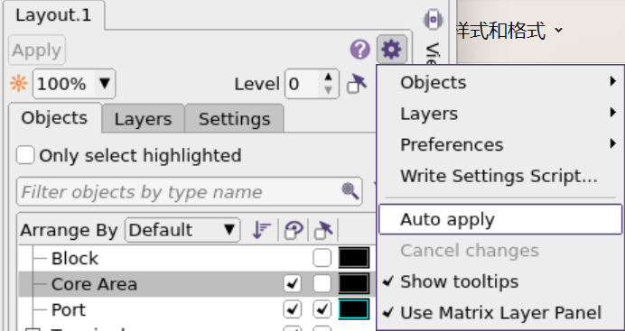

#### 步骤 2：控制各类设计对象显示（Objects 标签）

关闭布线：取消 Route 对应的 Visible 勾选 → 所有走线消失；

开启引脚显示：勾选 Pin → 单元输入 / 输出、电源引脚全部显示；

标签测试：反复勾选 / 取消 Labels → 控制单元名称显示；

放大任意一个宏单元，展开左侧 Labels 目录，额外勾选 Pin → 引脚名称也会显示；

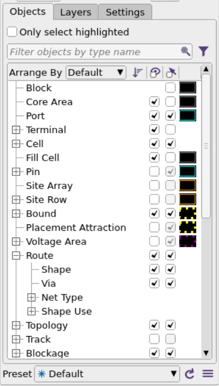

#### 步骤 3：控制对象「可选中」权限

保持视图为选择模式（Esc），鼠标拖拽画框，框选多个宏单元 → 宏被白色高亮（选中）；

在 Objects 面板，取消 Pin 对应的 Selectable 勾选（引脚不可选）；

再次用同样框选操作：只会选中宏单元，引脚不再被选中。

#### 步骤 4：保存自定义视图预设

点击 View Settings 面板上方 保存预设图标，选择 Save preset as...；

预设名称输入 MyPreset，点击 OK；

该预设会保存到路径 ~/.synopsys_icc2_gui/presets/MyPreset.tcl，重启工具自动加载；

下拉预设列表选择 Default，恢复默认视图。

#### 步骤 5：金属图层精细控制（Layers 标签）

切换到 Layers 标签页；

点击顶部过滤按钮：先取消 All Layers，再单独勾选 Routing（仅显示布线金属层），点击绿色对勾应用过滤；

逐层勾选 / 取消金属层（M1/M2...M9），观察视图变化；

重点观察电源网格：

水平电源走线：主要使用 M7；

垂直电源走线：主要使用 M8；

窄辅助电源走线：使用 M2；

拖动面板横向滚动条，查看图层更多配置项，最后点击重置箭头恢复默认图层设置。

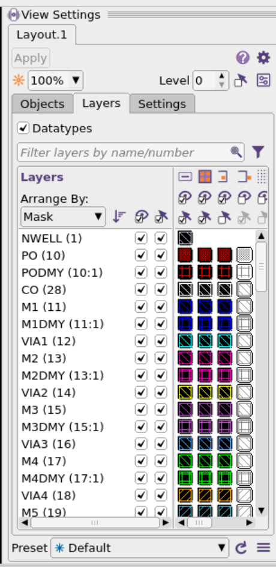

## Task 4：对象选中 & 属性查询（核心查询功能）

#### 步骤 1：切换至标准选择模式

按 Esc 键 / 点击左上角白色箭头图标，确保鼠标为选择光标。

#### 步骤 2：悬停预览（InfoTip）

鼠标不点击，悬浮在任意单元 / 走线上：

对象显示白色虚线框；

界面左下角弹出 InfoTip：实时显示对象基础属性。

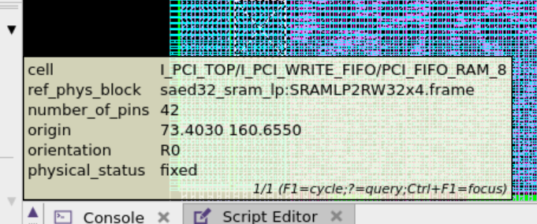

#### 步骤 3：单选、多选操作

单选：鼠标左键单击对象 → 实体白色高亮（选中）；

取消单选：点击布局空白处；

框选多选：左键拖拽画框，框内所有可选中对象全部选中；

追加选中：按住 Ctrl 键，左键点击其他对象 → 叠加选中。

#### 步骤 4：堆叠对象切换（多层重叠走线 / 通孔）

布局中金属线、通孔（Via）会多层重叠：

鼠标停在重叠区域，连续单击左键 → 循环切换选中对象；

快捷键替代：按 F1 → 仅切换查询对象，不改变选中状态。

#### 步骤 5：完整属性查询（Q 快捷键）

选中任意对象，按键盘 小写 Q：

右侧弹出 Query 面板，展示该对象全量属性（位置、类型、网络、层等）；

也可通过菜单：Select → Query Selection 打开查询面板。

#### 步骤 6：批量取消选择

方式 1：点击布局空白区域； 方式 2：菜单 Select → Clear； 方式 3：快捷键 Ctrl+D（推荐）。

#### 补充：亮度调节

View Settings 顶部有亮度滑块，降低未选中对象亮度，提升选中对象对比度，方便查看。

1

## Task 5：视图层级（View Level）控制

作用：默认只看顶层布局，调整 Level 可以深入查看宏单元内部结构。

#### 步骤 1：前置准备

在 Objects 面板，取消 Route 显示（隐藏走线，方便看宏）。

#### 步骤 2：修改宏填充样式

展开 Objects 面板中的 Cell 目录；

点击 Hard Macro 对应的填充图案；

在弹窗中选择纯黑色无填充样式，点击 OK（宏变为空心框，内部结构可见）。

#### 步骤 3：调整视图层级

将面板顶部 Level 数值从 0 修改为 1；

点击 Level 右侧 Hierarchy Settings（层级设置）；

勾选 Hard Macro → 允许展开宏内部；

放大任意 RAM 宏：可以看到宏内部的布线阻塞块（标准宏内部结构）。

#### 步骤 4：多层级视图

点击 Multiple Levels Active 按钮： 现在可以同时查看顶层 + 宏内部多层结构，常用于层次化设计分析。

💡 原厂应用：布局后检查宏内部阻塞、IP 接口连通性时必用此功能。

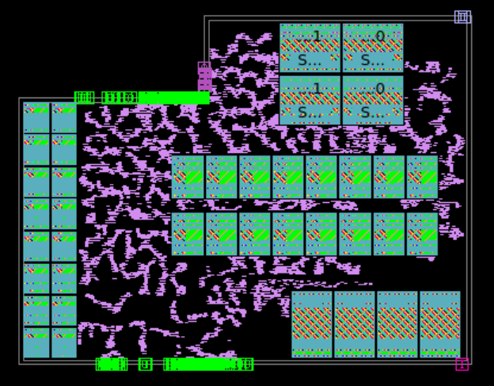

## Task 6：GUI 面板重组（自定义界面布局）

ICC II 面板支持拆分、拖拽、悬浮，适配不同屏幕尺寸。

#### 步骤 1：拆分 Query 面板

确保右侧 Query 面板已打开（如果未打开。选中对象按 Q 调出）；

右键点击 Query 标签，在弹出菜单选择 Split Query Below；

右侧面板区被拆分为上下两个区域，Query 面板置于下方。

#### 步骤 2：拖拽标签

将 Favorites（收藏）标签从上方区域拖拽到下方区域，实现面板自由调换。 同区域内也可拖拽标签调整顺序。

#### 步骤 3：面板进阶操作

右键标签 / 面板空白处，可使用：

Detach：面板悬浮独立窗口；

Dock：悬浮面板嵌回主界面；

Collapse：折叠面板（节省空间）。

#### 步骤 4：全局总览视图

点击主窗口右下角 「Display overview of view」图标：

弹出迷你总览窗口，黄色框代表当前视口；

拖动黄色框，布局视图会同步跳转；

点击主布局任意位置，总览窗口自动关闭。

## Task 7：时序分析窗口

#### 步骤 1：打开时序窗口

顶部菜单：Window → Timing Analysis Window。

#### 步骤 2：刷新时序数据

点击窗口左上角 Update 按钮，加载当前设计时序。

#### 视图解读（核心 QoR 基础）

直方图：红色柱 = 时序违例（不满足建立 / 保持时间）；绿色柱 = 时序正常；

点击最左侧红色违例柱，下方显示对应的时序端点；

选中第一条端点，右键 → Select Worst Path：布局视图中自动高亮最差时序路径。

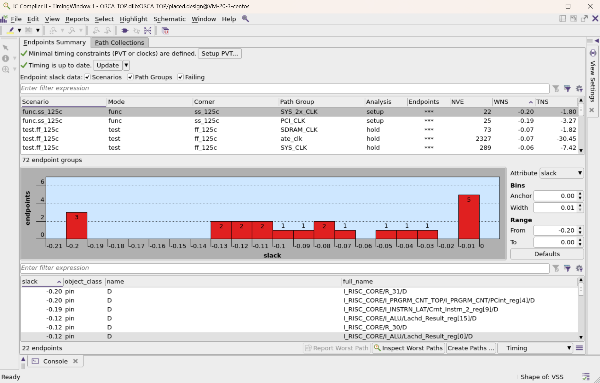

## Task 8：最近操作 & 收藏夹

#### 步骤 1：Recent 最近菜单

GUI 左上角 Recent 下拉菜单：记录你近期所有 GUI 操作（拥塞分析、时序窗口等），点击可快速复现。

#### 步骤 2：添加到收藏夹

在 Recent 列表中，右键任意功能（如 Timing Analysis Window）；

选择 Add to Favorites；

右侧 Favorites 面板会新增该功能，永久收藏，下次直接点击使用。

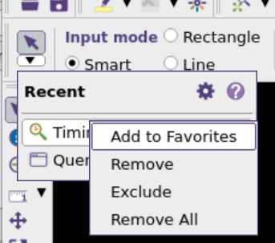

## Task 9：工具帮助体系（重中之重）

ICC II 帮助体系分为：命令搜索、Tab 补全、help/man 手册、自定义命令。

### 1. 命令搜索（快捷键 H）

快捷键 小写 H，或点击右上角放大镜图标，打开命令搜索框；

输入 place，工具自动匹配所有相关命令、配置项；

选中条目可直接打开配置窗口 / 执行命令。

### 2. 终端 Tab 自动补全

回到 icc2_shell> 命令行： 输入 h → 按 Tab → 自动补全命令，ICC II 支持命令、变量、文件名 Tab 补全。

```tcl
icc2_shell> h
help                 help_attributes      hyper_route_opt
help_app_options     history
```

### 3. help 命令（快速查命令用法）

通配符查询（记不全完整命令时使用）：

```tcl
# 查询所有包含 syn 的命令（时钟树综合相关）
help *syn*
# 查看 synthesize_clock_trees 详细参数
help synthesize_clock_trees -v
```

### 4. man 手册（完整官方文档）

ICC II 最权威的手册，等同于 Linux man：

```tcl
# 查看时钟树综合完整手册
man synthesize_clock_trees
# 查看指定报错码手册（排错常用）
man ZRT-536
```

### 5. 应用选项查询

查询工具配置项（App Option）：

```tcl
# 查看所有cts相关配置
report_app_options cts*
# 查看某个配置的详细手册
man cts.compile.enable_cell_relocation
```

### 6. 实训自定义快捷命令（原厂封装）

本实验环境内置自定义命令：

```tcl
# 模糊搜索命令/变量/配置（增强版查询）
aa syn
# 在独立窗口展示报告（长文本专用）
v man ZRT-536
# 查看所有自定义帮助命令
ces_help
```

## 实验收尾：退出 ICC II

两种退出方式：

GUI 菜单：File → Exit，弹窗选择 Discard All（放弃未保存修改）；

命令行输入：

```tcl
icc2_shell> exit
```

**执行成功标志：**Lab0 全部实验完成！
